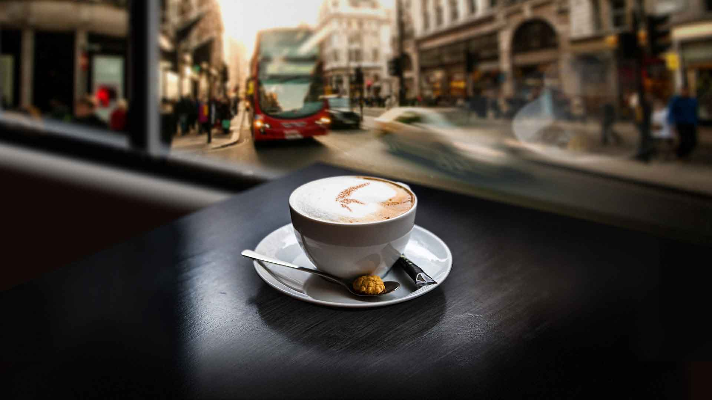

6月2日
要实现的效果：
1、无论如何拉动浏览器，图片总能填充整个背景，且不会出现滚动条
2、mouseenter可以切换页面

问题：
9、主要解决
（1）curP表示前一个页面，idx表示当前页面
8、用jQ的animate函数，创建背景由透明到不透明过度效果，会出现闪烁，不平滑
(1)timer = setInterval(function () {
        changePage((data.curP+1)%data.pLength);
  },data.dur);
——将定时器设置为data.curP+1避免，定时器开始时，data.curP=idx会让第一个页面闪动，因为第一个图透明度也会改变
7、图片轮播效果
（1）设置定时器对图片进行show，hide操作（或者利用postion定位）
6、如何使页面一直在1,2,3,4循环：cur%curP.length
5、利用data一个属性标识鼠标是否移入btns，进行处理
（1）开始思路是，鼠标移入btns，清除定时器，移出再创建一个去调用changePage
（2）思路二：
——1）判断是否移入，如移入changePage直接返回，不再切换页面

4、控制分页图片，是一张图，而不是单独的一个个，如何控制和图片一起滑动？
(1)为保证页面位置一致，最好还是只是切图，用background-position控制位置
(2)可能图位置会有问题，无法精确，最好还是代码控制
(3)btns和pages，数量是一致的，故利用$().find().eq()可以进行一一对应
3、判断浏览器是否支持css的animation
（1）style是一个对象，包含所有style
var isCss3=function(){
    var style=document.createElement("div").style;
    for(var k in style){
        if(k.toLowerCase().indexOf("animation")>0){
            return true;
        }
    }
    return false;
}();
2、如何让图片全部显示在同一个位置，z-index向叠加
（1）不显示图片用display：none
（2）不显示图片设置一个left：-9999999999；position：absolute
1、图片自适应浏览器
* {padding:0;margin:0;}
.wrap {height:100%;position:relative;overflow:hidden;}
.pages {position:relative;height:100%;}
.bgbox {position:absolute;width:100%;height:100%;top:0;left:0}
img {position:absolute;top:50%;left:50%;}

    

        

            
        

    

(function () {
    var $pages = $(".pages").find(".bgbox"),
            $wrap = $(".wrap"),
            $bgs = $pages.find("img");
    var resize = function () {
        var w=$(window).width(),
                h=$(window).height();
        $wrap.height(h);
        if(w/h<1920/1080){//对图片进行平移
            $bgs.height(h).css({width:"auto",margin:-.5*h+"px 0 0 "+-.5*1920/1080*h+"px"});
        }else{
            $bgs.width(w).css({height:"auto",margin:-.5*w*1080/1920+"px 0 0 "+-.5*w+"px"});
        }
    };
    $(window).resize(resize);
    resize();
})()

